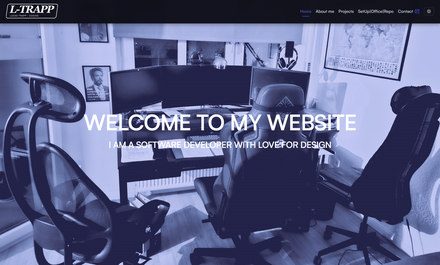
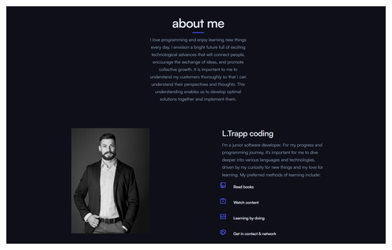
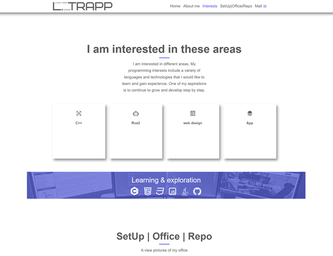

# ltcoding – Persönliche Portfolio‑Website

> Persönliche Website zur Darstellung meines Lernwegs als Junior Softwareentwickler

## 🧭 Überblick

Diese Website dient als **persönliches Portfolio- und Lernprojekt**. Sie zeigt meinen aktuellen Stand in der Software‑ und Webentwicklung, meine Interessen, Lernschwerpunkte sowie ausgewählte Inhalte aus meinen Repositories.

Die Seite wurde bewusst **klar, ruhig und strukturiert** gehalten, um sowohl den Inhalt als auch meinen Lernfortschritt in den Vordergrund zu stellen.

🔗 **Live‑Demo:** [https://kaaas58.github.io/ltcoding/](https://kaaas58.github.io/ltcoding/)

---

## 🎯 Ziel des Projekts

* Aufbau einer eigenen Portfolio‑Website
* Praktische Anwendung von HTML, CSS und grundlegenden Web‑Konzepten
* Dokumentation meines Lern‑ und Entwicklungsprozesses
* Zentrale Anlaufstelle für meine GitHub‑Projekte

---

## 🛠️ Verwendete Technologien

* **HTML5** – Seitenstruktur
* **CSS3** – Layout & Styling
* **Responsive Design** – Darstellung auf verschiedenen Geräten
* **GitHub Pages** – Deployment

---

## 📂 Inhalte der Website

* **Hero / Startbereich** – Kurze Einführung
* **About Me** – Persönlicher Hintergrund und Motivation
* **Interessen & Lernfelder** – Technologien und Themenbereiche
* **Learning at the moment** – Aktuelle Lernschwerpunkte
* **Setup / Office** – Einblicke in mein Arbeitsumfeld
* **Repository‑Verlinkung** – Weiterleitung zu meinen GitHub‑Repos

---

## 🚀 Motivation

Diese Website ist Teil meiner kontinuierlichen Weiterentwicklung als **angehender Softwareentwickler**. Der Fokus liegt nicht auf Perfektion, sondern auf **konstantem Lernen, Anwenden und Verbessern**.

---
## 📸 Screenshots
<!-- <div style="display: flex; justify-content: center; gap: 20px; flex-wrap: wrap;"> -->

<div style="display: flex; gap: 16px; flex-wrap: wrap;">

  <a href="screenshots/head.png" target="_blank">
    
  </a>

  <a href="screenshots/me.png" target="_blank">
    
  </a>

  <a href="screenshots/tech.png" target="_blank">
    
  </a>

</div>

---
## Structure
```plaitext
├── css/              # Stylesheets
├── fonts/            # Schriftarten
├── images/           # Allgemeine Bilder
├── js/               # JavaScript-Dateien
├── screenshots/      # Vollauflösende Screenshots der Website
│  ├── head.png
│  ├── me.png
│  └── tech.png
│
├── thumbnails/       # Kleine Vorschau-Bilder für README
│  ├── head.png
│  ├── me.png
│  └── tech.png
│
├── index.html        # Hauptseite
├── impressum.html    # Impressum
└── README.md         # Projektbeschreibung
```
---
## 🔮 Ausblick

Geplant sind u. a.:

* Erweiterung um neue Projekte
* Verbesserungen im Design und in der Struktur
* Ergänzung um JavaScript‑Funktionalität
* Technischere Inhalte und Dokumentationen

---

## 👤 Autor

**Lukas Trapp**
Junior Software Developer
<a href="https://kaaas58.github.io/ltcoding/" target="_blank">
  Zur Website
</a>
GitHub: [https://github.com/kaaas58](https://github.com/kaaas58)

---

> 💡 Hinweis: Dieses Projekt ist ein Lern‑ und Entwicklungsprojekt und wird fortlaufend erweitert.
