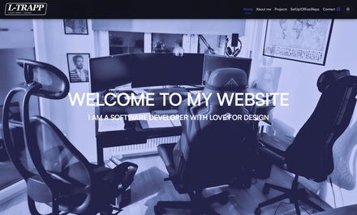
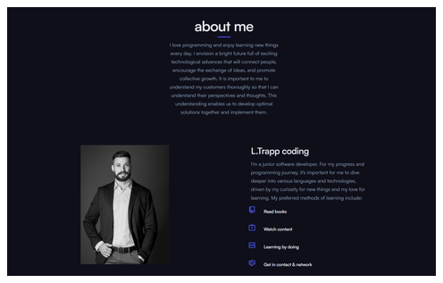
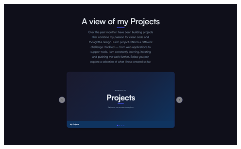

# LT Coding – Personal Portfolio Website

Persönliche Portfolio-Website von Lukas Trapp (Junior Software Developer). Präsentiert Projekte, Lernweg und Arbeitsumfeld – mit Dark/Light Mode, responsiver Navigation und Projekt-Karussell.

## Screenshot

   
   
  

## Features

- **Dark / Light Mode** – Toggle mit localStorage-Persistenz; Theme wird auch an verlinkte Projekte übergeben
- **Smart Navbar** – Versteckt sich beim Scrollen nach unten, erscheint beim Scrollen nach oben
- **Responsive Burger Menu** – Kompaktes Mobilmenü mit eigenem Darkmode-Toggle
- **Projekt-Karussell** – Swipe (Touch) und Drag (Maus) zum Durchblättern der Projekte
- **Active-Section-Highlighting** – Aktiver Nav-Link wird per IntersectionObserver erkannt
- **Kontaktformular** – Modal-Dialog mit FormSubmit-Integration
- **Bildergalerie** – Fancybox-Lightbox für Office/Setup-Fotos
- **Logo-Klick-Shortcut** – Klick aufs Logo scrollt zum Footer; erneuter Klick zurück nach oben

## Demo

[https://kaaas58.github.io/ltcoding/](https://kaaas58.github.io/ltcoding/)
